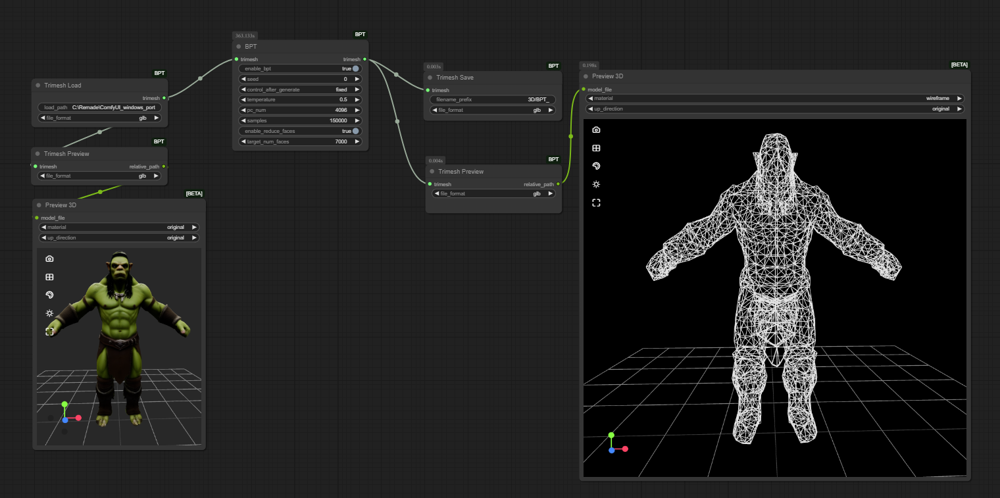
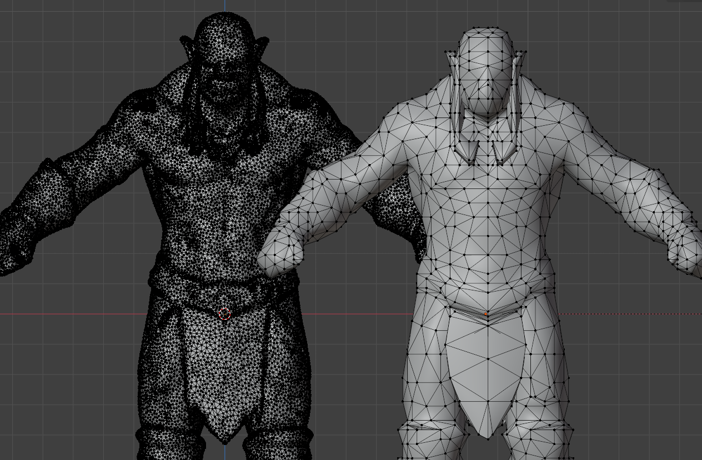

# ComfyUI-BPT
Comfyui [BPT](https://github.com/whaohan/bpt) Wrapper (Trimesh in/out connections)




# Installation

Download [Weights](https://huggingface.co/whaohan/bpt/blob/refs%2Fpr%2F1/bpt-8-16-500m.pt) and place in `ComfyUI\models\BPT`

Important: Some requirements require python 3.12 include/libs to found 
in python_embeded directory, to satisfy this you can copy them from a local 3.12 install

```
cd ComfyUI\custom_nodes\ComfyUI-BPT
..\..\..\python_embeded\python.exe -m pip install -r requirements.txt
```

# Usage

in/out Trimesh

# Related Interesting Projects

*[ComfyUI Hunyuan3D-2 Wrapper](https://github.com/kijai/ComfyUI-Hunyuan3DWrapper)

**[microsoft/Trellis](https://github.com/microsoft/TRELLIS)

[ComfyUI ShadowR](https://github.com/Easymode-ai/ComfyUI-ShadowR)

\* Fully Compatible with ComfyUI-BPT

\*\* Could be used on the `.glb` from `Trellis` with the `Trimesh load` / `Trimesh Save` interfaces supplied by this package
  
